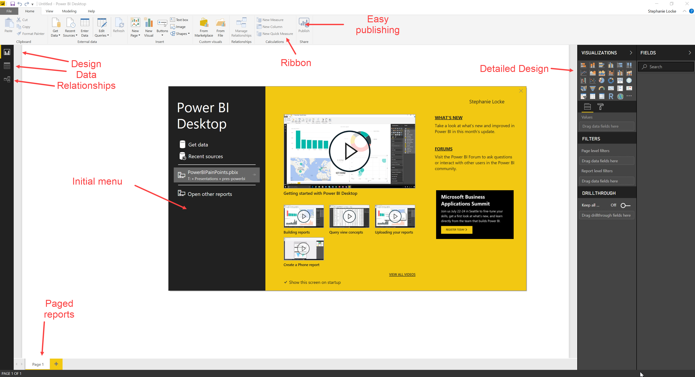
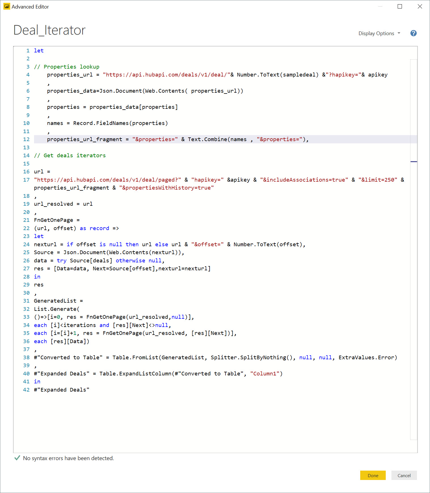

```{r setup, include=FALSE}
knitr::opts_chunk$set(echo = TRUE)
```

## Power BI desktop
The desktop app allows us to build data models and reports. We need to add data then use the three key areas of the app to surface the information.

- Relationships: Manage how different tables interact
- Data: View tables
- Report: Build a series of tabs with analysis



Power BI can consume data from many sources, including custom connectors that can be certified, provided open source, or developed and released internally.

## M / Power Query
M is the language used behind the scenes to get and transform data. It has rich capabilities for different data sources and common cleanup tasks. Many of these capabilities are surfaced through the app's ribbon but it's possible to purely write code, and even integrate R or Python into it's data pipeline steps.

> You can also write custom connectors to support your important datasets if nothing currently available suits your needs. 

Here is an example of custom M that:

1. Talks to an API to get possible fields needed to be called
2. Iterate an API call that returns a limited set of records
3. Combine the results



## DAX
DAX is a formula language for producing Excel-ish formulae that are context and relationship aware. These formulae are intended primarily to produce aggregations that work at different levels of hierarchy, in pivot tables etc. that scale to even a trillion rows.

```
Value at Current Stage = SUMx(Deals,Deals[Deal size]*related('Current Pipeline Stage'[Probability]))
```

## Exercises
1. Connect to one of your regular data sources, or sample data available to you
2. Setup any relationships between multiple tables
3. Produce some initial visualitions based on
4. Use the Q&A visual to add a visual using natural language querying

## Recommended resources and readings
