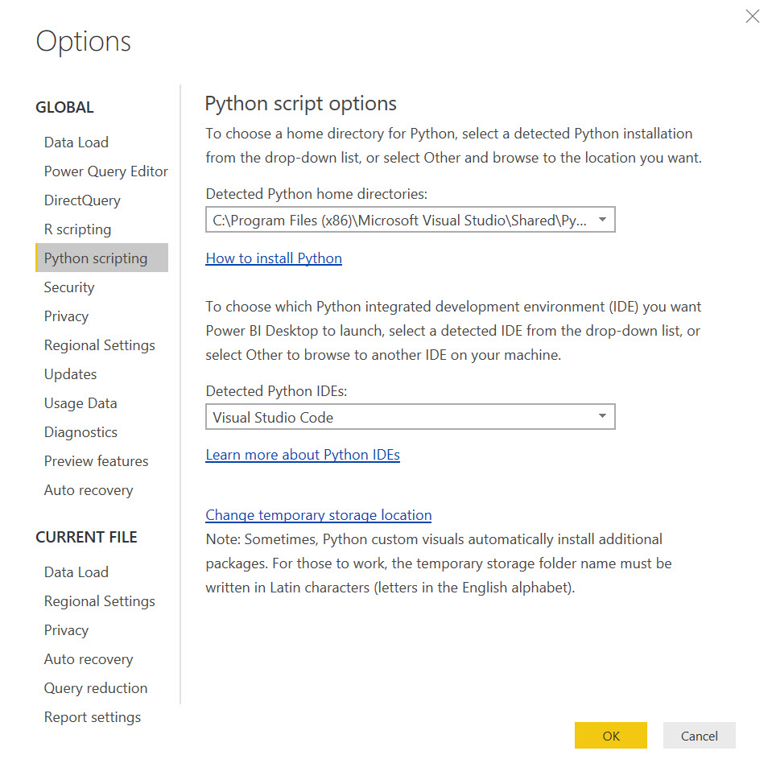

```{r setup, include=FALSE}
knitr::opts_chunk$set(echo = TRUE)
```

## Python inputs
Python can be used as the source of data in Power BI. These Python scripts can leverage standard Python programming principles. As well as being able to score data as you load it, you can use Python to get around limitations in data sources.

> When dashboards get published online, access to an Python installation is often done through the use of a *gateway* that will sit on your server / machine enabling access to a local setup enabling you to set up the environment however you wish.

You should make sure the right Python version is used.



Now you can also use Python as part of a pipeline inside a [Power Query dataset load](https://docs.microsoft.com/en-us/power-bi/desktop-python-in-query-editor).

### Setup
Let's get some data available as CSVs -- these will mimic external datasets for our work today but we could equally be connecting to databases, Spark, or some other source.

```{python}
from sklearn.datasets import load_breast_cancer
import pandas as pd
import numpy as np

bc = load_breast_cancer()

bc_df = pd.DataFrame(data = np.c_[bc['data'], bc['target']],
                     columns = bc['feature_names'].tolist() + ['target'])
                     
bc_df.to_csv("breastcancer.csv",index =False)
```


### Using Python to import data
We can use the `Get Data > Python script` option to allow the use of Python code. We can import data using Python:

```python
import pandas as pd

bc_df = pd.read_csv("breastcancer.csv")
```

Notes:

- Scripts are editable in an IDE to make life easier
- An Python script *must* return a tabular dataset to Power BI

### Scoring data on import
Simply importing a vanilla CSV isn't leveraging Python's strengths. Let's make a quick model and use this score data as we import it.

Outside Power BI, let's construct a model (an obviously bad one but brievity is our friend):

```{python}
import pandas as pd
import numpy as np
from sklearn.datasets import load_breast_cancer
from sklearn.externals import joblib
from sklearn.model_selection import train_test_split
from sklearn.ensemble import RandomForestClassifier

dataset = load_breast_cancer()
X = dataset.data
y = dataset.target

X_train, X_test, y_train, y_test = train_test_split(X, y, test_size = 0.3, random_state=12345)

rf = RandomForestClassifier()
rf.fit(X_train, y_train)

filename = 'py_cancer.sav'
joblib.dump(rf, filename)
```

Now we have a model that we can use to score data upon ingestion.

```{python}
from sklearn.datasets import load_breast_cancer
from sklearn.externals import joblib
import pandas as pd
import numpy as np

filename = 'T:/powerbifordatascientists/py_cancer.sav'
loaded_model = joblib.load(filename)
dataset = pd.read_csv("T:/powerbifordatascientists/breastcancer.csv")
x = dataset.loc[:, dataset.columns != 'target']
y = dataset[['target']]
pred = loaded_model.predict(x)
result = dataset.assign(pred=pred)
```

This data can now be integrated with other business data to enable understanding of how the model performs / batch scores / impacts the business.

## Python visualisations
We can use Python visuals in Power BI to extend past the native visualisation capability. Any visuals will be restricted to the filtered dataset based on other interactions on the page, making it contextual too.

> There's a pesky design choice that data gets deduped before going into a viz - ensure you add an ID col in to keep things safe!

Python visuals cannot currently run on the online version currently.

### Static visualisation
Use the Python visualisation for static charts. 

```{python eval=FALSE}
import matplotlib.pyplot as plt
dataset.plot.scatter(x='mean area', y='mean radius')
plt.show()
```

> There are limits to how much data Power BI wants to send to a visual. If you need to summarise more data than it will let you, consider doing pre-aggregation.

## Exercises
1. Build a model for the `wine` dataset and write out the dataset and the model to disk
3. Load the data into Power BI and add predictions to it
4. Visualise the results

## Recommended resources and readings
- [Using Python to load data into Power BI](https://docs.microsoft.com/en-us/power-bi/desktop-python-scripts)
- [Python visuals](https://docs.microsoft.com/en-us/power-bi/desktop-python-visuals)
