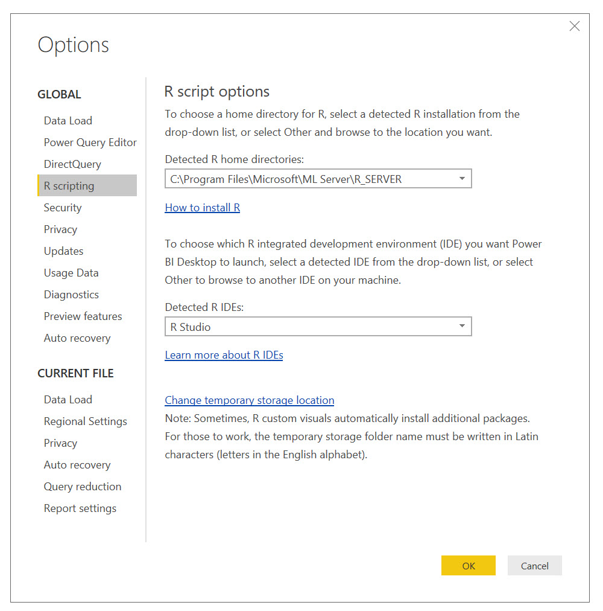

```{r setup, include=FALSE}
knitr::opts_chunk$set(echo = TRUE)
```

## R inputs
R can be used as the source of data in Power BI. These R scripts can leverage standard R programming principles. As well as being able to score data as you load it, you can use R to get around limitations in data sources.

> When dashboards get published online, access to an R installation is often done through the use of a *gateway* that will sit on your server / machine enabling access to a local setup enabling you to set up the environment however you wish.

You should make sure the right R version is used.



Now you can also use R as part of a pipeline inside a [Power Query dataset load](https://docs.microsoft.com/en-us/power-bi/desktop-r-in-query-editor).

### Setup
Let's get some data available as CSVs -- these will mimic external datasets for our work today but we could equally be connecting to databases, Spark, or some other source.

```{r}
if(!require(nycflights13)) install.packages("nycflights13")
if(!require(tidyverse)) install.packages("tidyverse")
if(!require(modelr)) install.packages("modelr")

library(tidyverse)
write_csv(nycflights13::flights, "flights.csv")
write_csv(nycflights13::airlines, "airlines.csv")
```


### Using R to import data
We can use the `Get Data > R script` option to allow the use of R code. We can import data using R:

```r
readr::read_csv("flights.csv")
```

Notes:

- Scripts are editable in RStudio to make life easier.
- An R script *must* return a tabular dataset to Power BI.

### Scoring data on import
Simply importing a vanilla CSV isn't leveraging R's strengths. Let's make a quick model and use this score data as we import it.

Outside Power BI, let's construct a model (an obviously bad one but brievity is our friend):

```{r}
library(nycflights13)
library(dplyr)

flights %>% 
  sample_frac(.7) %>% 
  lm(arr_delay~hour, data=.) %>% 
  saveRDS("r_flights.RDS")
```

Now we have a model that we can use to score data upon ingestion.

```{r}
library(modelr)
library(readr)

location = "T:\\powerbifordatascientists"

mod = readRDS(file.path(location, "r_flights.RDS"))

"flights.csv" %>% 
  file.path(location, .) %>% 
  read_csv(progress = FALSE) %>% 
  add_predictions(mod) ->
  scored_data
```

This data can now be integrated with other business data to enable understanding of how the model performs / batch scores / impacts the business.

## R visualisations
We can use R visuals in Power BI to extend past the native visualisation capability. Any visuals will be restricted to the filtered dataset based on other interactions on the page, making it contextual too.

> There's a pesky design choice that data gets deduped before going into a viz - ensure you add an ID col in to keep things safe!

R visuals can run independently of a server side connection but have a limited set of [packages that are available](https://docs.microsoft.com/en-us/power-bi/service-r-packages-support). Key packages like ggplot2 and htmlwidgets are supported so, in practice, it's rare you can't build the viz you're were hoping to.

### Static visualisation
The basic R visualisation is for static charts. 

```{r eval=FALSE}
library(ggplot2)
library(dplyr)

dataset %>% 
  ggplot() + 
  aes(x=month) +
  geom_bar(fill="red") +
  scale_x_continuous(breaks=1:12)
```

> There are limits to how much data Power BI wants to send to a visual. If you need to summarise more data than it will let you, consider doing pre-aggregation.

### Custom R interactive visualisations
Out of scope for today, but custom R visualisations based on nifty packages like htmlwidgets can be built and shared. There is a JavaSCript based command-line util `pbiviz`  which will allow you to produce R visuals.

[Info](https://microsoft.github.io/PowerBI-visuals/tutorials/building-r-powered-custom-visual/creating-r-powered-custom-visual-with-html-output/)


## Exercises
1. Install the FFTrees package
2. Build a model for the `car` dataset and write out the dataset and the model to disk
3. Load the data into Power BI and add predictions to it
4. Visualise the results

## Recommended resources and readings
- [Using R to load data into Power BI](https://docs.microsoft.com/en-us/power-bi/desktop-r-scripts)
- [R visuals](https://docs.microsoft.com/en-us/power-bi/desktop-r-visuals)
